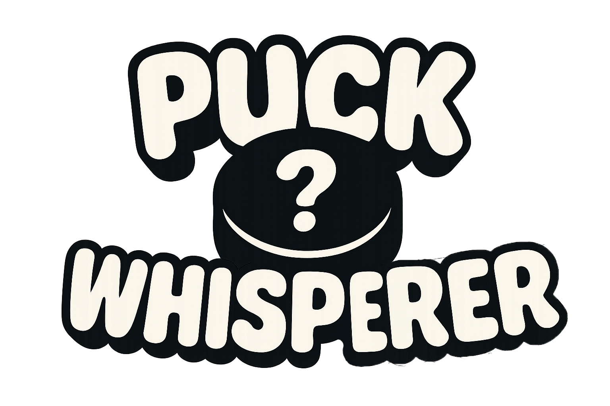

# 🏒 PuckWhisperer

**PuckWhisperer** is a web-based NHL guessing game where you test your hockey knowledge by guessing a mystery player in 3 tries or less. Use hints like draft info, teams played for, stats, and even a silhouette to help you win.  

All to find out whether or not you truly know Puck.

---

## 🎮 How to Play

1. Click **New Player** to start a game.
2. Use the **Hint** buttons to unlock clues:
   - **Hint 1**: Years played on each team
   - **Hint 2**: Draft info
   - **Hint 3**: Jersey number & position
   - **Hint 4**: Player stats
   - **Hint 5**: Player silhouette
3. Click **Guess** to search and select a player.
4. You have 3 guesses. Choose wisely!

---

## ✨ Features

- 🔍 Smart search with live NHL player results
- 🧠 Hint system unlocked in order
- 🖼️ Team logos and silhouette reveal
- 🧩 Manual player selection mode

---

## ⚙️ Tech Stack

- **React + Vite**
- **Node.js / Express** (for backend API)
- **Mongo DB** (player database)
- **Data Collection** (using NHL API)
- **Deployed with Render**

---
